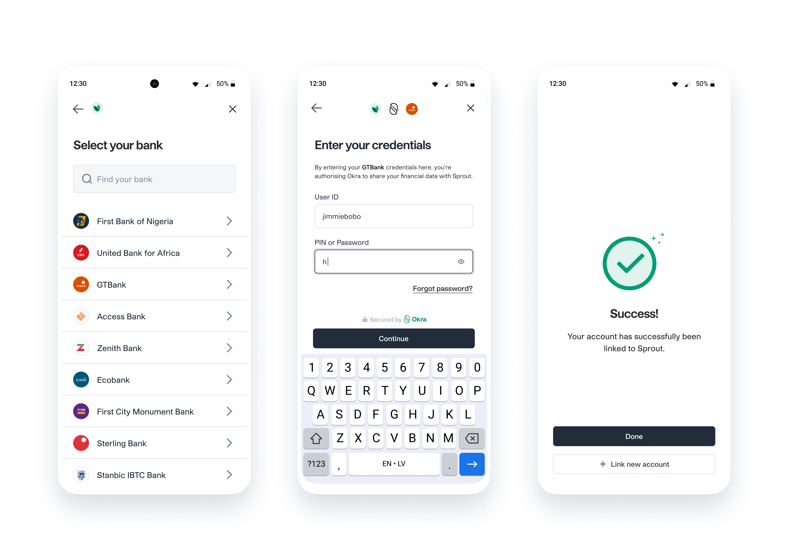

# Okra Widget React Native SDK


React Native SDK for implementing the Okra widget - Okra is a safe and secure web drop-in module and this library provides a front-end web (also available in [iOS](https://github.com/okraHQ/okra-ios-sdk), [Android](https://github.com/okraHQ/okra-android-sdk), and [JavaScript](https://github.com/okraHQ/okra-js)) SDK for [account authentication](https://docs.okra.ng/docs/widget-properties) and [payment initiation](https://docs.okra.ng/docs/creating-a-charge) for each bank that Okra [supports](https://docs.okra.ng/docs/bank-coverage).

## Try the demo
Checkout the [widget flow](https://docs.okra.ng/docs/widget-flow/) to view how the Okra Widget works.

## Before getting started
- Checkout our [get started guide](https://docs.okra.ng/docs/onboarding-guide) to create your developer account and retrieve your Client Token, API Keys, and Private Keys.
- Create a [sandbox customer](https://docs.okra.ng/docs/using-sandbox), so you can get connecting immediately.

*Bonus Points*
- Setup [Slack Notifications](https://docs.okra.ng/docs/slack-integration) so you can see your API call statuses and re-run calls in real-time!

### Getting Started
This library would help you add Okra widget to your hybrid android/ios application in no time. All you need to do is ...

## Install

```sh
npm install okra-react-native-official
```

## Usage
```js
import React, { Component } from 'react';
import {
  Okra,
  OkraOptionsProps,
  OkraUrlProps,
} from 'okra-react-native-official';
import { Button, StyleSheet, View } from 'react-native';
import { NavigationContainer } from '@react-navigation/native';
import { createStackNavigator } from '@react-navigation/stack';

const Stack = createStackNavigator();

// Build with options
let okraOptions: OkraOptionsProps = {
  okraOptions: {
    callback_url: 'https://webhook.site/ded54b3f-f4f5-4fa1-86c3-0def6098fb4d',
    clientName: 'client',
    color: '#953ab7',
    connectMessage: 'Which account do you want to connect with?',
    currency: 'NGN',
    env: 'production-sandbox', // for sandbox use production-sandbox
    filters: {
      banks: ['access-bank', 'guaranty-trust-bank'],
      industry_type: 'all',
    },
    meta: "Any data type",
    options: {
      name: "Client Name"
    },
    isCorporate: false,
    key: 'Enter Key here',
    token: 'Enter token here',
    limit: 24,
    logo: 'https://cdn.okra.ng/images/icon.svg',
    products: ['auth', 'balance', 'identity', 'transactions'],
    widget_failed: '',
    widget_success: 'Your account was successfully linked to Okra, Inc',
  },
  onError: (error) => {
    console.log(error);
  },
  onSuccess: (data) => {
    console.log(data);
  },
  onClose: () => {
    console.log('on close');
  },
  onBeforeClose: () => {
    console.log('on before close');
  },
};

//OR
//Build With ShortUrl
let okraUrl: OkraUrlProps = {
  shortUrl: 'bc_kWKf2l',
  onError: (error) => {
    console.log(error);
  },
  onSuccess: (data) => {
    console.log(data);
  },
  onClose: () => {
    console.log('on close');
  },
  onBeforeClose: () => {
    console.log('on before close');
  },
};


function HomeScreen({ navigation }) {
  const goToOptions = () => {
    navigation.navigate('WithOptions');
  };

  const goToShortUrl = () => {
    navigation.navigate('WithShortUrl');
  };

  return (
    // @ts-ignore
    <View style={styles.container}>
      <Button title="Build With Options" onPress={goToOptions} />
      <View style={{ marginVertical: 10 }} />
      <Button title="Build With ShortUrl" onPress={goToShortUrl} />
    </View>
  );
}

const styles = StyleSheet.create({
  container: {
    flex: 1,
    alignItems: 'center',
    justifyContent: 'center',
  },
});

// Build With Options
function OkraOptionsScreen() {
  return Okra.buildWithOptions(okraOptions);
}

//Build With ShortUrl
function OkraShortUrlScreen() {
  return Okra.buildWithShortUrl(okraUrl);
}

export default class App extends Component {
  render() {
    return (
      <NavigationContainer>
        <Stack.Navigator>
          <Stack.Screen name="Home" component={HomeScreen} />
          <Stack.Screen name="WithOptions" component={OkraOptionsScreen} />
          <Stack.Screen name="WithShortUrl" component={OkraShortUrlScreen} />
        </Stack.Navigator>
      </NavigationContainer>
    );
  }
}

```
## Okra.buildWithOptions Options

| Name             | Type          | Required | Default Value       | Description                                                                         |
|------------------|---------------|----------|---------------------|-------------------------------------------------------------------------------------|
| `app_id `        | `String`      | true     |                     | Your app id from your Okra Dashboard.                                               |
| `okraKey `       | `String`      | true     |                     | Your public key from your Okra Dashboard.                                           |
| `token `         | `String`      | true     |                     | Your token from your Okra Dashboard.                                                |
| `env `           | `String`      | false    | `production`        | production(live)/production-sandbox (test)                                          |
| `products`       | `Array`       | true     | `['Auth']`          | The Okra products you want to use with the widget.                                  |
| `payment`        | `Booelan`     | false    |                     | Whether you want to initiate a payment (https://docs.okra.ng/docs/payments)         |
| `charge `        | `Object`      | false    |                     | Payment charge opject (https://docs.okra.ng/docs/widget-properties#set-up-payments) |
| `products`       | `Array`       | true     | `['Auth']`          | The Okra products you want to use with the widget.                                  |
| `logo `          | `String(URL)` | false    | Okra's Logo         |                                                                                     |
| `name `          | `String`      | false    | Your Company's name | Name on the widget                                                                  |
| `color`          | `HEX   `      | false    | #3AB795             | Theme on the widget                                                                 |
| `limit`          | `Number`      | false    | 24                  | Statement length                                                                    |
| `filter`         | `Object`      | false    |                     | Filter for widget                                                                   |
| `isCorporate`    | `Boolen`      | false    | `false`             | Corporate or Individual account                                                     |
| `connectMessage` | `String`      | false    |                     | Instruction to connnect account                                                     |
| `widget_success` | `String`      | false    |                     | Widget Success Message                                                              |
| `widget_failed`  | `String`      | false    |                     | Widget Failed Message                                                               |
| `callback_url`   | `String(Url)` | false    |                     |                                                                                     |
| `currency`       | `String`      | false    | NGN                 | Wallet to bill                                                                      |
| `exp`            | `Date`        | false    | Won't expire        | Expirary date of widget                                                             |
| `options`        | `Object`      | false    |                     | You can pass a object custom values eg id                                           |
| `onSuccess`      | `Function`    | false    |                     | Action to perform after widget is successful                                        |
| `onClose`        | `Function`    | false    |                     | Action to perform if widget is closed                                               |
| `onError`        | `Function`    | false    |                     | Action to perform on widget Error                                                   |
| `BeforeClose`    | `Function`    | false    |                     | Action to perform before widget close                                               |
| `onEvent`        | `Function`    | false    |                     | Action to perform on widget event                                                   |

View a complete list of customizable options [here](https://docs.okra.ng/docs/widget-properties)

## Okra.buildWithShortUrl Options

| Name          | Type       | Required | Description                                                                                |
|---------------|------------|----------|--------------------------------------------------------------------------------------------|
| `short_url`   | `String`   | true     | Your generated url from our [App builder](https://docs.okra.ng/docs/widget-customization). |
| `onSuccess`   | `Function` | false    | Action to perform after widget is successful                                               |
| `onClose`     | `Function` | false    | Action to perform if widget is closed                                                      |
| `onError`     | `Function` | false    | Action to perform on widget Error                                                          |
| `BeforeClose` | `Function` | false    | Action to perform before widget close                                                      |
| `onEvent`     | `Function` | false    |                                                                                            | Action to perform on widget event

## Done connecting?
Checkout our [API Overiview](https://docs.okra.ng/docs/api-overview) and see how to use the data you've received and [other products](https://docs.okra.ng/docs/selfie-verification) you can use to create more personalized experiences for your customers!

## Not a developer?
Get started without writing a single line of code, Try our App Builder! [Click here to get started](https://docs.okra.ng/docs/widget-customization)

## Contributing

See the [contributing guide](CONTRIBUTING.md) to learn how to contribute to the repository and the development workflow.

## License

MIT

---

Made with [create-react-native-library](https://github.com/callstack/react-native-builder-bob)

## Other information
For enquires and questions, contact
- support@okra.ng
